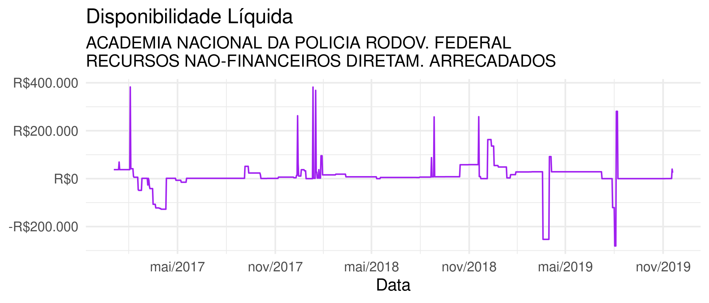

<!-- README.md is generated from README.Rmd. Please edit that file -->

# empocamento

## Instalação

``` r
# install.packages("devtools")
devtools::install_github("curso-r/empocamento")
```

## Exemplos

O pacote traz extrações de movimentações diárias dos ministérios da
Justiça (`movimentacoes_diarias_mj`) e da Educação
(`movimentacoes_diarias_mec`). A série histórica são dos itens:

  - limite de saque (`LIMITES DE SAQUE (OFSS, DIVIDA, BACEN E PREV)`);
  - obrigações a pagar (`VALORES LIQUIDADOS A PAGAR (EXERCICIO + RP)`);
    e
  - pagamentos (`PAGAMENTOS TOTAIS (EXERCICIO E RAP)`)

<!-- end list -->

``` r
library(dplyr)
library(ggplot2)
library(empocamento)

series_mj <- prepara(movimentacoes_diarias_mj)
```

``` r
series_mj_filtrada <- series_mj %>%
  filter(
    NO_ORGAO_MAXI == "MINISTERIO DA JUSTICA E SEGURANCA PUBLICA",
    NO_ORGAO == "DEPARTAMENTO DE POLICIA RODOVIARIA FEDERAL/MJ",
    NO_UG == "ACADEMIA NACIONAL DA POLICIA RODOV. FEDERAL",
    NO_FONTE_RECURSO == "RECURSOS NAO-FINANCEIROS DIRETAM. ARRECADADOS"
  )

series_mj_filtrada$series_temporais[[1]] %>%
  ggplot(aes(x = NO_DIA_COMPLETO_dmy, y = disponibilidade_liquida)) +
  geom_line() 
```



Explorar as séries de fluxo de caixa com interface gráfica (Shiny app)

``` r
explorar(series_mj)
```

O pacote traz função pronta para extrair alguns descritores sobre o
perfil histórico de cada UG-FONTE.

``` r
descritores_mj <- adiciona_descritores(series_mj)
#> [13:18:54] WARNING: amalgamation/../src/learner.cc:556: Loading model from XGBoost < 1.0.0, consider saving it again for improved compatibility
glimpse(descritores_mj)
#> Rows: 856
#> Columns: 14
#> $ id                                     <chr> "877362ca453c6994eb320acb312d8…
#> $ NO_ORGAO_MAXI                          <chr> "MINISTERIO DA JUSTICA E SEGUR…
#> $ NO_UG                                  <chr> "ACADEMIA NACIONAL DA POLICIA …
#> $ NO_ORGAO                               <chr> "DEPARTAMENTO DE POLICIA RODOV…
#> $ NO_FONTE_RECURSO                       <chr> "RECURSOS NAO-FINANCEIROS DIRE…
#> $ series_temporais                       <list> [<tbl_df[1053 x 12]>, <tbl_df…
#> $ n                                      <int> 366, 366, 366, 366, 25, 366, 3…
#> $ integral_sobre_media_dos_gastos        <dbl> 1.923441e+00, 1.930178e+01, -3…
#> $ disponibilidade_estritamente_crescente <dbl> 0.286563806, 0.192964481, 0.40…
#> $ iadl                                   <dbl> 6.871119e+00, 3.869226e+01, 8.…
#> $ valor_nominal                          <dbl> 12514.202, 32119.427, -72154.5…
#> $ valor_nominal_conservador              <dbl> -182137.149, -17666.144, -7200…
#> $ indicador_tempo                        <dbl> 0.9480874, 0.6530055, 0.844262…
#> $ suspeita_de_empocamento                <dbl> 0.107843578, 0.057445586, 0.28…
```
